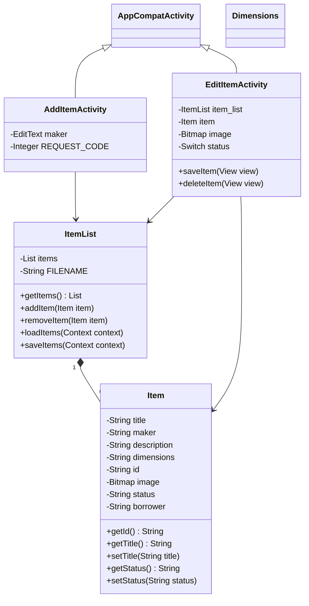

# uml

```mermaid
classDiagram
    class AppCompatActivity

    class AddItemActivity {
        -EditText maker
        -Integer REQUEST_CODE
    }

    class EditItemActivity {
        -ItemList item_list
        -Item item
        -Bitmap image
        -Switch status
        +saveItem(View view)
        +deleteItem(View view)
    }

    class ItemList {
        -List items
        -String FILENAME
        +getItems() List
        +addItem(Item item)
        +removeItem(Item item)
        +loadItems(Context context)
        +saveItems(Context context)
    }

    class Item {
        -String title
        -String maker
        -String description
        -String dimensions
        -String id
        -Bitmap image
        -String status
        -String borrower
        +getId() String
        +getTitle() String
        +setTitle(String title)
        +getStatus() String
        +setStatus(String status)
    }

    class Dimensions

    AppCompatActivity <|-- AddItemActivity
    AppCompatActivity <|-- EditItemActivity
    ItemList "1" *-- "0..*" Item
    AddItemActivity --> ItemList
    EditItemActivity --> ItemList
    EditItemActivity --> Item

```
